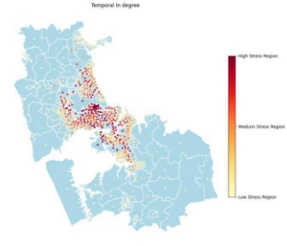
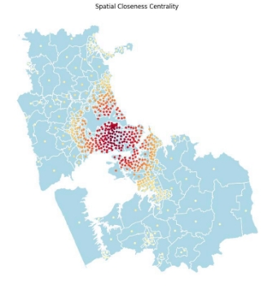
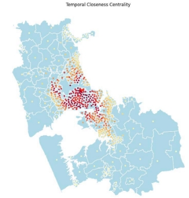
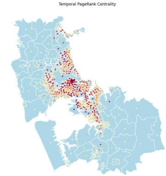
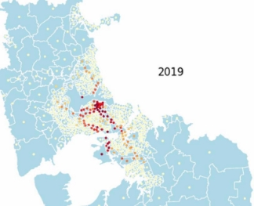
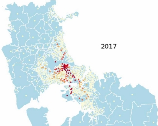
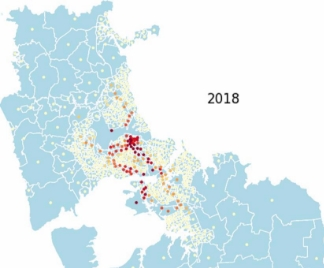
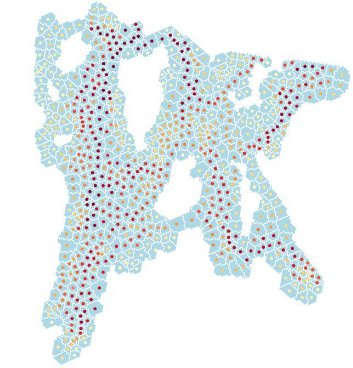
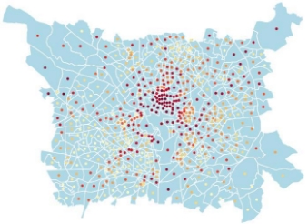

Traffic Flow Analysis Using Uber Movement Data 

*Syed Najeeb Iqbal   Syed Asad Rizvi*  *Fareed Hassan Khan* 

*MS – Data Science*  *MS – Data Science*   *MS – Data Science*              *Institute of Business Administration  Institute of Business Administration  Institute of Business Administration* Karachi, Pakistan  Karachi, Pakistan  Karachi, Pakistan               [s.najeeb.21205@khi.iba.edu.pk ](mailto:s.najeeb.21205@khi.iba.edu.pk)                  [s.rizvi.25365@khi.iba.edu.pk ](mailto:s.rizvi.25365@khi.iba.edu.pk)                    [f.khan.25367@khi.iba.edu.pk ](mailto:f.khan.25367@khi.iba.edu.pk)

***Abstract*— Different techniques to analyze traffic flow of different cities is proposed in this paper, with the motivation to  solve  traffic  issues  particularly  traffic  congestion  and bottlenecks by identifying peak rush hours and other mobility patterns. The analysis uses Uber Movement data consisting of Uber  trips  held  in  various  cities  and  is  based  on  the comparisons of spatial and temporal graphs. These graphs visualize geographical structure of the city incorporated with various traffic movement patterns based on mean travel times between  the  trips.  Centrality  measures  such  as  Degree, Closeness, Betweenness and PageRank were used to identify peak rush hours and the effect of bottlenecks, while Greedy Modularity  algorithm  was  used  as  a  community  detection technique to observe how communities change throughout the day with respect to traffic flow. This approach is selected because it gives us a clear view of analyzing the impact of traffic  flow  at  various  locations.  This  analysis  would  help transportation sectors especially cargo and courier companies to  deliver  goods  smoothly  without  any  issues,  while government departments can also use this analysis to plan solutions for the improvement of roads and infrastructure in different localities. For future, this analysis could lead to more impactful outcomes when new data is added, so that more solutions can be proposed for traffic related problems.** 

1. INTRODUCTION

Traffic  congestion  has  long  been  a  critical  issue  in different parts of the world. The ever-increasing population and infrastructure have created a challenge for the people to commute freely yet facing traffic congestion problems at various ends. For this reason, the analysis of traffic flow patterns has been a subject of discussion in recent years [1]. 

The need to solve traffic congestion problems as well as identifying peak rush hours is very important, as it causes several  difficulties  to  consumers  as  well  as  businesses, which demand a clear traffic flow for smooth end-to-end deliveries.  Peak  traffic  times  are  different  for  different cities,  depending  upon  the  work  hours  and  business schedules. Hence, heavy traffic is usual in these times which have become a source of problem for everyone. 

To solve this problem, we studied and applied several network  measures  to  analyze  traffic  flow  patterns  of different cities across the world. Through these measures, we were able to identify traffic congested areas, peak rush hours, and how traffic bottlenecks affect the flow across various cities. This analysis could help different businesses especially  transportation  sector,  while  government departments can also provide solutions for urban planning by  taking  key  steps  for  the  improvement  of  roads  & infrastructure. 

The  literature  review  involved  analysis  of  traffic  flow patterns through comparison of spatial and temporal graphs  of different cities. For instance, it used Uber movement data to compare the patterns of different cities such as Manila, Johannesburg,  Washington,  and  Paris.  It  used  centrality measures such as degree, betweenness, closeness, and page rank algorithms to identify different mobility patterns as per analysis.  It  also  used  Girvan-Newman  Algorithm  as  a community detection technique to analyze traffic patterns across various times in a day [1].

In  this  analysis,  we used Uber  movement  dataset of different cities, which include Auckland, Mumbai, Toronto and Washington. The temporal and spatial graphs of these cities were created and analyzed using the same centrality measures, and traffic flow patterns were identified to extract various insights. Also, Greedy modularity algorithm is used in this analysis as a community detection technique. 

Furthermore, it’ll be seen in detail that how our traffic flow analysis is related with the previous work and research papers  on  the  same  topic.  The  measures,  models,  and algorithms to  identify traffic  congested  areas,  peak  rush hours and traffic bottlenecks are discussed, and results are presented in the form of visualizations, through spatial and temporal graph comparisons. We have also discussed how can we improve the analysis by adding pros and cons of the same. 

2. RELATED WORK
1. *Data Collection* 

The  dataset  used  for  traffic  flow  analysis  is  “Uber Movement” which is readily available to access on Uber’s website. The dataset includes more than two billion Uber trips across 07 different cities of the world. For the analysis, the dataset also includes arithmetic mean, geometric mean, and standard deviations for aggregated travel times for each specified date range between every traffic analysis zone pair in each city [1]. In the case of spatial graphs, the graph is undirected, and weights are computed as the pairwise distance  between  geographic  centroids  of  each  node, computed using Haversine distance. While for temporal graphs, the graph is directed, and weights are the mean travel times between the source and destination as available in the dataset [1].  

The data for trips used here is taken on a granular level, i.e., in  the  terms  of  hourly  aggregates.  Also,  in  total,  24 temporal graphs are generated, each with its own set of weights [1].  

The other dataset was the New York City taxi dataset which consists of data from more than 4.5 million Uber rides in the city along with the time, latitude, and longitude of the journey [2].  

Data was gathered from various sources, such as mobile phone  call  records  and  sensors  installed  on  the  cabs. Dataset  of  more  than  14  million  cab  journeys approximately 14,776,615 taxi rides that were gathered in New York City over the course of one month was used for their analysis [3]. 

2. *Methodology* 

Centrality  measures  such  as  degree,  closeness,  and betweenness are calculated for weighted directed graphs. For that, node degrees and shortest paths between each node are calculated for the weighted case. Additionally, for node importance,  the  PageRank  algorithm  is  used,  which  is defined in terms of the out-degree of its nodes and is also calculated for the weighted case [1]. 

The calculated measures from the temporal graphs in terms of  traffic  flow  are  interpreted,  so  that  insights  can  be extracted  across  different  hours  of  the  day  and  can  be compared with the same measures of spatial graphs. Traffic bottlenecks  and  rush  hours  are  identified  using betweenness centrality and PageRank Algorithms. Using Girvan  Newman’s  Algorithm,  community  detection  is applied to detect communities in both temporal and spatial graphs [1].  

For  the  spatial  approach,  the  visualizations  that  were mentioned include a choroleth map, a difference choroleth map, and traffic flow fields. Choroleth maps are used to distinguish between the regions that are faster to reach and those that take more time by using a color gradient. The colors represent the mean travel time and are made from a given source point. Different choroleth map helps us to understand the change in travel times from the same source to all other areas during a certain period for example a day, week, or year. With their help, we can observe that the average travel time from any place to a popular tourist destination always increased on weekends [2].  

Visualizations through temporal information include the polar coordinates and the calendar view. Through polar coordinates, we were able to represent information in the form of a circle where the radius of the circle represents the average travel times between two places. Hence, we were able to identify the hours at which it takes the maximum time to travel between two places. The calendar view is used to identify the times of heavy traffic [2].  

A dynamic network technique has been used to analyze travel patterns in the city. They created 744 sub-networks by  aggregating  the  rides  dataset  into  hourly  snapshots. Many  ride  networks  each  provide  data  for  fixed-length periods  with  similar  distances  between  their  beginning places. Such an approach is useful for tracking changes in various properties [3]. 

Here, nodes represent the number of unique pick-up and drop-off locations of rides made during this time window. Number of edges represent the number of unique pick-ups to drop-off pairs of rides made during this time window. Average Betweenness centrality yields an estimation of the network’s  efficiency,  concerning  the  number  of  nodes whose  adequate  availability  is  required  to  preserve  the network’s  ability  to  maintain  efficient  flow  without increasing the length or duration of trips between arbitrary points. Average Closeness centrality yields an estimation of the compactness of the network, that is – how short it is to travel between an arbitrary pair of network nodes [3]. 

3. *Results and Findings* 

There are 24 temporal graphs constructed, with each measure calculated for each city and each hour of the day, using  distances  as  edge  weights.  Whereas  for  spatial networks,  each  measure  is  calculated  for  each  city, undirected [1].  

1. In-and-out degrees: Found that traffic congestion in 

rush  hours  keeps  on  increasing  in  the  morning  time  in Johannesburg [1]. 

2. Betweenness  centrality:  For  temporal  graphs, 

betweenness is found only in a few sub-regions of Manila in the morning. For spatial graphs, betweenness reduces as it is a function of the distance between one region and the center of the network [1]. 

3. Closeness  centrality:  Both  temporal  and  spatial 

networks  show  almost  similar  results  for  closeness centrality in Washington city. A difference highlighted was some  lighter  nodes  in  the  temporal  graph  are  darker  in spatial  graphs,  which  shows  a  less  developed  area  of Washington [1]. 

4. PageRank: The PageRank score of Paris city at 09:00 

am (morning time) is analyzed. The graph with darker tone areas has a higher PageRank score, while with lighter tone areas has lower scores. In the temporal graph, in the core center of the city, the score is higher, while around the concentric rings, the importance is decreased, and hence score is lower. In spatial graphs, the nodes which are far away from their neighbors have higher PageRank scores, while the rest of the nodes have uniform patterns across nodes, which is of lesser interest [1].  

Using Girvan Newman Algorithm, community detection for Johannesburg city is done for both temporal and spatial graphs. For temporal graphs, upon analysis of four different times of the day, it is observed that traffic flow keeps on increasing towards the city center during morning rush hour. Also, upon continuous analysis, it is observed that the traffic flow starts to reduce as soon as it approaches nighttime. Similarly,  distance-based  communities  are  detected  for spatial graphs [1].  

It  was  discovered  that  the  dynamic  network  approach produces lower valued results than the previous calculation using the overall aggregation (10% decrease), caused by the fact that each node pair's possibility of being connected is decreased [3].  

The findings of their analysis show that ride-sharing usage is very volatile over time, indicating that any strategy or plan 

that ignores this feature and opts for a static approach would unquestionably  be  either  extremely  wasteful  or  supply insufficient resources. They demonstrate that it is possible to  model  the  potential  use  of  ride-sharing  based  on  the topological  aspects  of  the  rides  network  using  their suggested technique [3]. 

4. *Pros & Cons* 

For  each zone pair in  each of  these  cities,  it offers  the geometric mean, arithmetic mean, and standard deviations for aggregated trip times over a selected month, weekday, and hour of the day (HOD). In terms of the statistic used, our focus for this work is the arithmetic mean [7]. 

*B.  Data Processing* 

In this study, it is shown how network measures can help in  The limitation with uber movement data is that it is not analyzing traffic flow problems in different cities of the  possible  to  directly  create  a  graph  so  to  detect  traffic world.  The  problems  of  traffic  congestion,  traffic  congestion within a city. Therefore, we must create a graph bottlenecks, and rush hours were identified and highlighted  that represents the fundamental city structure upon which by  analyzing  different  mobility  patterns  across  various  trips depend [3]. 

cities. This is done by observing and comparing the change 

in measures in both temporal and spatial networks [1].   To  depict  the  connection  of  the  areas  on  which  Uber 

collects data, we constructed a City structure graph. The This study identified and performed analysis on mobility  data  comes includes a GeoJSON file that describes the 

patterns for weekdays, and not for weekends. However, the  polygons that define a city's zones. Each zone is defined by same traffic data can be analyzed for weekends, so that  set of polygons and each polygon is represented by a list of people’s travel patterns on weekdays and weekends can be  points in the lat-long coordinate system. The entire data is compared, and the change in measures can be observed.  available as part of the Uber movement GeoJSON format. Also, we can add more data from previous years as well as  We then compute the centroids of these zone [2]. 

the rest of the years to obtain in-depth mobility patterns 

across the cities [1].  

One strength of this study is its methodology, which starts  with  a  background  examination  of  the  traffic  planning  techniques used in the urban design process and then moves  on to talk about data-driven mobility modeling, to estimate  human movement. Such modeling is essential because it  enables a more thorough, fact-based understanding of "how  people  travel."  That  has  given  researchers  a  broad  perspective on traffic congestion, urban transportation, and  its underlying dynamics [3].   

Since their suggested approach is agnostic to the actual route  taken by the drivers. It would be interesting to study how  the  introduction  of  ride-sharing  affects  additional  parameters like deviations (that for a merged journey may  become cost-effective), usage of toll routes, etc. In addition,  crucial elements like incentives and fees elements can be  better represented as "remedies" to analyze travel patterns  changes but they were absent from the network dataset [3].  

3. GROUND WORK 

This section explains certain important graph concepts to 

the weighted case that will be helpful in our study, as well  Once we have a graph that depicts the layout of the city, we as a description of the travel time data we used and the  specify two sets of weights, leading to two distinct readings temporal and spatial graphs we created from it.  of the graph. 

*A.  The Data Set* 

Beginning July 2017, Uber introduced its Uber Movement service. It offers access to an overview of travelling time between  various  areas  of  the  chosen  city  and  contains billions of trip data [3]. 

The  researchers  are  welcome  to  use  Uber  Movement, which is available for direct download in .csv and in .JSON format from its website. In this work, we mainly focus on the  trip times  data  for  the  cities of  Auckland, Toronto, Mumbai, Washington D.C., Johannesburg.  

1) *Spatial  graph:*  Consider  the  graph  as  being 

undirected, with the weights representing the separations between  the  distance  between  the  areas.  Each  area geographic  centroid  was  calculated,  and  using  the Euclidean  distance,  we  then  calculated  the  pairwise distances between centroids. Gs = ( Vs,Es,ws )* where (Vs,Es) is the graph, and  ws  is  a weight i.e., distance between regions [5].* 

2) *Temporal  graph:*  Consider  the  graph  as  being 

directed,  with  the  weights  representing  the  travel  time. Reason it’s a directed graph is because because the average travel time from area A to area B may differ from the time 

of travel from area B to A. Moreover, Weightes can be treated as any of the four total trip length metrics offered 

by Uber, but for the sake of time, we have only treated arithmetic mean as  the  weights for the  temporal graph.          Gt *=* ( Vt,Et,wt ) where (Vt,Et) is the graph, and wt  is a weight 

i.e., arithmetic mean of travel times between regions [5]. 

*C.  Project lifecycle* 

As previously mentioned, we will be working with two weighted graphs: an undirected geographical graph and a temporal graph (directed). We must adapt the centrality metrics we learnt in class to weighted directed graphs in order to find the structurally significant nodes in our graph after gathering the dataset and making graphs from it.  

We need to extend these definitions to the weighted case in order to use metrics like closeness and betweenness in our research  because  they  are  specified  in  terms  of  node degrees and shortest pathways. We will evaluate the Page Rank in addition to these metrics to assess the significance of our nodes. Important insights are also being identified using a number of additional metrics. 

The  process  diagram  that  follows  details  each  of  the significant actions we took to complete each task. 

IV. EXPERMENTAL RESULTS

*A.  Dataset* 

There were different datasets that were used from the uber movement repository. While selecting the datasets we had a few things in mind. a)  

Population size. The greater the population the greater the number of uber trips to region. b) Developed and developing region. We selected different data sets from the  developed  regions  such  as  Auckland  and Washington, and developing region such as Mumbai. This was done to compare the traffic patterns between developing and developed regions.  

IDENTIFYING STRESS REGIONS 

We made use of indegree centrality to identify the high traffic or stress regions across an area. In degree centrality will tell us about the number of uber trips that ended in that region.  

The  distinction  between  areas  is  done  through  a  color gradient. The darker regions represent high stress zones, and the lighter regions represent low stress zones.[1]  

Figure 1 

|Area ID |In Degree Centrality |
| - | - |
|260 |0.901141 |
|136 |0.899240 |
|264 |0.887833 |
|308 |0.868821 |
|298 |0.861217 |
|**...** |**...** |

Figure 2 

Both the indegree and outdegree centrality measures give us almost the same results since every trip that ends at a location will also start from that position. 

IDENTIFYING BOTTLENECKS 

Bottlenecks are those where the traffic abruptly comes to a stop or where the  density of traffic becomes very high suddenly. There can be a few reasons for that. 

1) *The cars are being parked on the road and they* 

*occupy the last two lanes of the road. This will convert a four lane road to a two lane raod and bottlenecks will be created.*  

2) *A three lane road convert to a two lane road due to* 

*a road which was under construction.* 

In  our  analysis  we  have  made  use  of  the  betweeness centrality to identify bottlenacks. The temporal and spatial graphs are made using the betweenes centralit.  

The portion of the graphs where it shows a dense region in the spatial graph and a non dense in the temporal graph is the region where a bottleneck exists.*    

Betweenness centrality is calculated based on the shortest distance between the nodes. For the spatial graph it tells us about the dense traffic regions.  

Or the regions where a particular node was crossed the most. For the temporal graphs the weights are kept as the average time between two destinations.  

Therefore, the shortest path will be calculated based on time rather than the distance which was the case in the spatial graph.  

Hence there will be different dense region in the temporal since the region which is dense in the spatial graph will be lighter in the temporal graph. [1] 

Figure 5 

IDENTIFYING CITY CENTERS 

Figure 5 

We  made  use  of  closeness  centrality  to  identiify  city centers.  City  centers  are  those  regions  which  are  more developed as compared to the other parts of the city.  

Closeness centrality gives us those nodes that are clossest to all other nodes in the graph. Since the spatial graaph is based on distance, the nodes whoch represent the centroid of the graph will have a high closeness centrality.  

This  visualozation  doesn’t  give  us  any  useful  insights because it only gives us the centroid.  

For the temporal graph, centrality is calculated using at average time.  

This will highlight regions that are easiest to reach since they will be the one which are closest to all other nodes based on time.  

Hence the city centers will have a high closeness centrality and  they  are  represented  by  the  darker  regions  in  the temporal graph. [1] 

Table of Figure 5 

Table of Figure 6 

Figure 7 

IDENTIFYING HOTSPOTS 

Figure 7 

Hotspots are identified using the eigen vector centrality. Hotspots are those regions whose adjoining regions are high stress zones. 

For  city  councils  to  quickly  identify  traffic  congestion hotspots  in  a  certain  urban  region  and  implement appropriate measures there, this type of representation may be useful. 

For example, in Karachi there is millennium mall whose neighboring regions are high stress zones. 

These  trouble  areas,  which  typically  correlate  to crossroads, pose a threat to network effectiveness as well as the safety of vehicles and pedestrians. 

This means that millennium mall will be a hotspot. Eigen vector centrality gives more weightage to those nodes who are connected to the important nodes. Therefore, the darker regions can be considered as hotspots. [1] 

IMPACT OF HOLIDAYS 

We can expect different traffic patterns for weekdays and weekends. For weekdays the commute is usually from the place of residence to the workplace. While on weekends people usually prefer to visit parks, lakes and places for liesure activities.  

To  identify  this  distinction  we  made  use  on  indegree centrality measure and made temporal graphs for different time periods during the day. In the figures below you can see different comparisions.  

For the highlighted region weekdays have lighter nodes as compared to the weekends. This can be because of the pubs and bars which the people tend to visit more during the weekends.  

It can also be because of the existence of parks in this region which people which will have a higher number of visitors on weekends. [2] 

IMPACT OF SEASONS 

These two graphs were made using the uber movement dataset for Toronto, Canada. We made use of the in-degree centrality measure.   

If  you  closely  look  at  the  highlighted regions  for  both  graphs, you will observe that there are some nodes which  were dark in the summers and light in the winters.   

This is because in this region there exists a waterfall which  gets frozen during the winters. Therefore, fewer number of  people visit that place. This analysis was also verified by  Google maps. [2]  

YEARLY TRAFFIC PATTERNS  

These graphs were made using the indegree centrality. If we go from 2017 to 2018, we can see big difference in the highlighted area.  

The  reason  for  this  change  can  be  linked  with  the development of a school, office, malls, or any other place with a high footfall.  

That is why the density of traffic goes from low to high. After 2018 there a lot of difference that is observed which means that the traffic patterns were almost similar during these years. [2] 

DEVELOPED VS DEVELOPING COUNTRIES 

The basic difference between developed and developing regions  is  that  the  developed  regions  have  a  better infrastructure  and  road  network  as  compared  to  the developing regions.  

Therefore, if we make a temporal graph for these regions, we should observe a clear difference.  

To  differentiate  between  these  regions,  we  identified hotspots for both. The developing region which is Mumbai has  hotspots  spread  around  the  whole  map,  while  the developed region which is Washington only hotspots in the center. 

MUMBAI 

WASHINGTON 

EVOLUTION OF TRAFFIC 

Finding communities within our network is one of our aims to understand the composition of our traffic flow data. This would make it possible to identify certain areas inside or between our cities that behave in concert at particular hours of the day or certain days of the year. 

We will use a greedy modularity maximization to do this, starting  with  each  node  in  its  own  community  and continually joining the pair of communities that lead to the biggest  modularity  until  no  more  gain  in  modularity  is conceivable (a maximum). 

 

12:00 A.M.                           03:00 A.M. 

`         `06:00 A.M.                            10:00 A.M. 

Figure 10: Johannesburg Communities 

Figure 10 shows the detected communities at four different times of day: 12:00 a.m., 3:00 a.m., 6:00 a.m. and 10:00 a.m. We identify two communities in the temporal graph: the blue and the red regions. During morning rush hour, it is easy to watch how the red community expands as traffic begins to go in that direction. We would have observed a contracting  behavior  as  the  time  wore  on  if  we  had conducted our investigation later in the day. 

CONCLUSION 

In the above analysis we have discussed about the stress regions using the indegree centrality. We also identified bottlenecks  and  the  city  centers.  There  was  also  a comparison that was made between the traffic patterns of weekdays and weekends, and summer and winter seasons. All of these visualizations and analysis will be useful for the government organization since they will be able to work on the urban planning of the city. These results are also useful for the logistic companies since they will be able to figure out the best route to deliver their items. 

REFERENCES

1. Mackenzie  Pearson,  Javier  Sagastuy  and  Sofia  Samaniego.  Traffic Flow  Analysis  Using  Uber  Movement  Data:  2017, [http://snap.stanford.edu/class/cs224w-2017/projects/cs224w-11- final.pdf ](http://snap.stanford.edu/class/cs224w-2017/projects/cs224w-11-final.pdf)
1. Vihang Godbole and Shane Pearlman. Analysis of Uber travel times across  major  cities  in  the  world, [https://users.soe.ucsc.edu/~pang/261/w19/projects/vgodbole/Final/C MPS261_final_report.pdf ](https://users.soe.ucsc.edu/~pang/261/w19/projects/vgodbole/Final/CMPS261_final_report.pdf)
1. Tal Altshuler, Rachel Katoshevski and Yoram Shiftan. Ride Sharing and  Dynamic  Networks  Analysis:  2017, [https://arxiv.org/pdf/1706.00581.pdf ](https://arxiv.org/pdf/1706.00581.pdf)
1. Arun V Sathanur, Vinay Amatya, Arif Khan, Robert Rallo, and Kelsey Maass. Graph Analytics and Optimization Methods for Insights from the  Uber  Movement  Data, [https://arifulkhan.github.io/publication/15/15.pdf ](https://arifulkhan.github.io/publication/15/15.pdf)
1. Xi Liu, Li Gong, Yongxi Gong, and Yu Liu. Revealing travel patterns and  city  structure  with  taxi  trip  data, [ https://sci- hub.se/10.1016/j.jtrangeo.2015.01.016 ](https://sci-hub.se/10.1016/j.jtrangeo.2015.01.016)
1. Yeran Sun, Yinming Ren, Xuan Sun. Uber Movement Data: A Proxy for  Average  One-way  Commuting  Times  by  Car [https://www.researchgate.net/publication/340146586_Uber_Moveme nt_Data_A_Proxy_for_Average_One- way_Commuting_Times_by_Car ](https://www.researchgate.net/publication/340146586_Uber_Movement_Data_A_Proxy_for_Average_One-way_Commuting_Times_by_Car)
1. Travel  Time  Analysis  with  Uber  Movement  (QGIS3) [https://www.qgistutorials.com/en/docs/3/travel_time_analysis.html ](https://www.qgistutorials.com/en/docs/3/travel_time_analysis.html)
1. Uber  Movement:  Travel  Times  Calculation  Methodology [https://movement.uber.com/_static/c9bce307d99643c3.pdf ](https://movement.uber.com/_static/c9bce307d99643c3.pdf)
